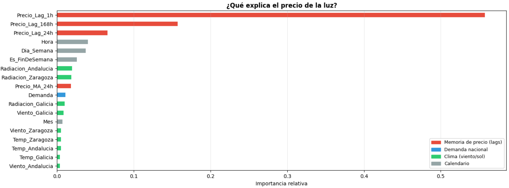
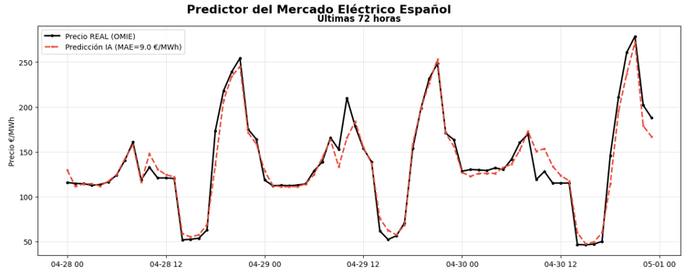
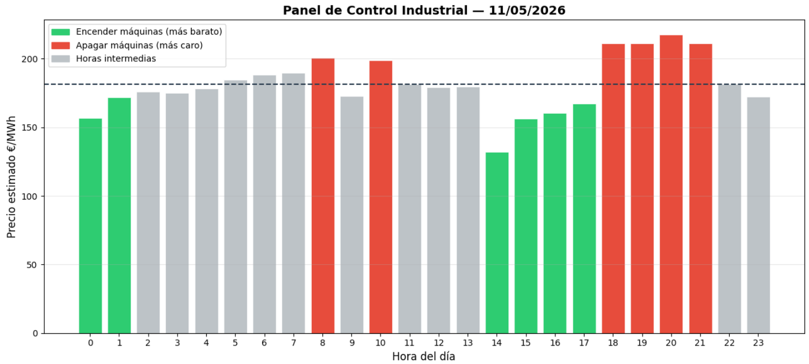

# 🔋 Spanish Electricity Market Predictor

A machine learning tool that predicts hourly electricity prices in Spain (OMIE market) and generates **industrial consumption optimization recommendations**.

Built with real public data from Red Eléctrica de España (REE) and Open-Meteo.

---

## What it does

- Downloads 3 years of hourly electricity prices from the REE public API
- Combines price data with meteorological forecasts from 3 strategic locations (Galicia, Zaragoza, Andalucía) to capture wind and solar generation patterns
- Trains an XGBoost model that achieves **MAE of ~9 €/MWh** and **R² of 94%**
- Predicts the full 24-hour price curve for the next day
- Generates an **industrial panel** identifying the 6 cheapest and 6 most expensive hours — with an average peak/valley spread of ~51 €/MWh

---

## Key findings

The model reveals what actually drives electricity prices in Spain:

1. **Price memory dominates** — the price 1 hour ago explains >50% of the current price. The market has strong inertia.
2. **Weekly patterns matter more than daily weather** — the lag from 168h ago (same slot last week) is the second most important feature.
3. **Solar radiation in Andalucía and Zaragoza** is the most relevant climate variable — not wind, not temperature.
4. **National demand** adds signal but is less important than price history.

> ⚠️ **Important disclaimer**: This model predicts the OMIE wholesale market price (€/MWh). The final electricity cost for industrial consumers includes additional components (grid tariffs, capacity payments, taxes, retailer margin) that vary by contract and are not modelled here. Use this tool for pattern analysis and relative optimization, not as absolute cost prediction.

---

## Results

### Model performance on test set (last 5,000+ hours)
| Metric | Value |
|--------|-------|
| MAE    | 9.01 €/MWh |
| R²     | 94.2% |

### Feature importance


### 72-hour prediction vs reality


### Industrial optimization panel (example)


---

## How to run

### Option A — Google Colab (recommended)
No local installation needed. Upload the scripts to Colab and run.

```python
# Install dependencies
!pip install xgboost python-dateutil

# Run full pipeline (downloads data + trains model + saves pkl)
# Takes ~5-10 minutes due to API downloads
%run mercado_electrico.py
```

### Option B — Local
```bash
pip install -r requirements.txt
python mercado_electrico.py
```

---

## Workflow

```
First run (full pipeline):
mercado_electrico.py
    → Downloads 3 years of data from REE + Open-Meteo APIs
    → Trains XGBoost model
    → Saves: modelo_mercado_electrico.pkl
             features_mercado_electrico.pkl
    → Generates analysis charts
    → Predicts tomorrow + generates industrial panel

Daily use (fast prediction, no retraining):
prediccion_rapida.py
    → Loads saved pkl model
    → Downloads only recent prices (lags) + tomorrow's weather forecast
    → Generates industrial panel in ~30 seconds
```

---

## Project structure

```
spanish-electricity-market-predictor/
├── README.md
├── requirements.txt
├── mercado_electrico.py        # Full pipeline: data + training + prediction
├── prediccion_rapida.py        # Fast daily prediction using saved model
└── resultados/                 # Output charts
    ├── prediccion_vs_realidad.png
    ├── feature_importance.png
    └── panel_industrial.png
```

---

## Data sources

| Source | Data | API |
|--------|------|-----|
| Red Eléctrica de España (REE) | Hourly OMIE prices + national demand | `apidatos.ree.es` (public, no key required) |
| Open-Meteo | Historical + forecast weather | `open-meteo.com` (public, no key required) |

Both APIs are **free and require no authentication**.

---

## Tech stack

- **Python 3.10+**
- **XGBoost** — gradient boosting model
- **pandas / numpy** — data processing
- **scikit-learn** — train/test split, metrics
- **matplotlib / seaborn** — visualization
- **joblib** — model persistence

---

## Author

Alberto Zorzano Gamazo — Industrial Engineer (MSc candidate)
[LinkedIn]([https://linkedin.com/in/albertozorzano](https://www.linkedin.com/in/alberto-zorzano-287254264/)) · [GitHub]([https://github.com/albertozorzano](https://github.com/albertozorzano-engineering))

---

*Built as a personal project to explore the Spanish electricity market using publicly available data.*
